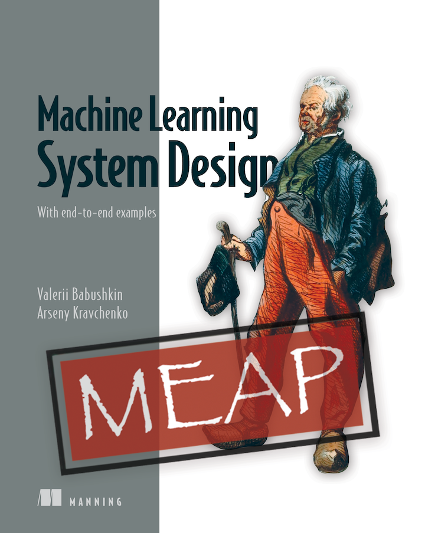

# Machine Learning System Design With End-To-End Examples

[Machine Learning System Design With End-To-End Examples](https://arseny.info/ml_design_book) is a comprehensive step-by-step guide designed to help you work on your ML system at every stage of its creation—from information gathering and preliminary steps to implementation, release, and ongoing maintenance.

The book is dedicated to ML System Design, and not a particular technology, but a high-level framework on how to approach problems related to building, maintaining, and improving big machine learning systems.

As ML/AI is getting bigger and bigger these days, there are many books and courses on algorithms, domains, and other specific aspects. However, they hardly provide an entire vision. It leads to the problem authors saw in multiple companies, where solid engineers successfully build scattered subcomponents that can’t be gathered together into a fully functioning reliable system. This book is aimed to fix this, among other things.

[The book](https://arseny.info/ml_design_book) is not beginner-friendly. We expect our readers to be familiar with ML basics (you can understand an ML textbook for undergraduate students) and to be fluent in applied programming (you faced real programming challenges outside the studying sandbox). The book will be helpful for:
- People preparing for an interview for a Machine Learning Engineer/Manager position.
- Software Engineers, Engineering Managers and Machine Learning Practitioners working with an existing complex system, who want to either understand or improve it.
- People who plan to design their own ML system or designed one already and want to be sure they didn’t forget anything critical

The book structure tends to resemble that of a checklist or manual, with ingestion of campfire stories from our own experience. It can be read at once or used at any moment working on a specific aspect of a Machine Learning System

## Table of contents 

Part 1:  **Preparations**

1 Essentials of machine learning system design  

2 Is there a problem? 

3 Preliminary research

4 Design document

Part 2:  **Early Stage**

5 Metrics and losses

6 Gathering datasets

7 Validation

8 Baseline solution

Part 3:  **Intermediate steps**

9 Error analysis

10 Training pipeline

11 Features and feature engineering

12 Reporting

Part 4:  **Integration and growth**

13 Integration

14 Reliability and monitoring

15 Serving and inference optimization

16 Ownership and maintenance
